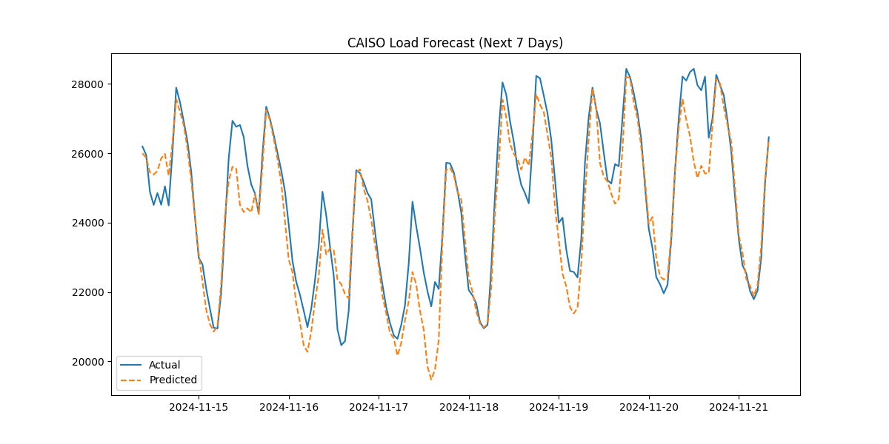
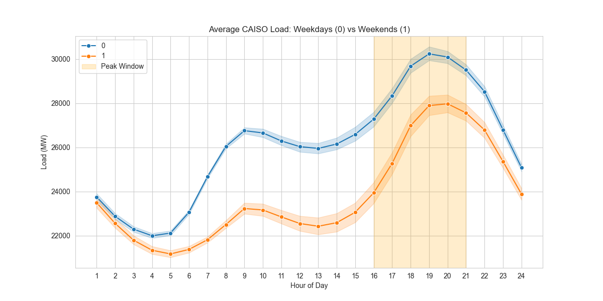

# CAISO Load Forecasting

This project builds a reproducible pipeline to forecast hourly electricity load for the California Independent System Operator (CAISO). It merges raw CAISO load spreadsheets, engineers calendar and lag features, optionally adds weather data, and trains an XGBoost regressor for short-term forecasting.


## Motivation 
The project was inspired by our groups interest in energy and weather. Last year, the four of us learned from traders at Millenium how they use weather data to be able to forecast energy load. This is then used to make trades on energy bonds. We decided that we could disclose this experiment to the California load and test how our model does.

## Dataset
The raw dataset consists of CAISO historical hourly load Excel files. By default, raw files live under `data/raw/` and derived datasets live under `data/processed/` (both are ignored by git).

## Installation
From the project root, set up your environment and install the package in editable mode:

```bash
python -m venv .venv
source .venv/bin/activate
pip install -e ".[dev,scraper]"
```

* **`.[dev]`**: Installs development tools including `pytest` and `pytest-cov`.
* **`.[scraper]`**: Installs `requests` and `beautifulsoup4` required for the data downloader.

## Download Raw Data
With the virtual environment activated, run the scraper to fetch monthly `.xlsx` files from CAISO’s historical library:

```bash
python setupdata/scraper.py
```

## Usage
The pipeline is accessible via the `load-forecast` command, configured through `pyproject.toml`.

### Running the Full Pipeline
Execute the standard sequence (merge → calendar → lags) in one command:
```bash
load-forecast pipeline
```

## Plots
The following plots are included for quick visualization in GitHub. Fresh runs will write plots to `artifacts/` by default.

### Forecast sanity check (example 7-day segment)


### Load patterns (EDA)


### Individual Steps
For granular control, run steps individually:
* **Merge Data**: `load-forecast merge --input-dir data/raw/caiso_load_data --output-file data/processed/caiso_load_complete.csv`
* **Calendar Features**: `load-forecast calendar --input-file data/processed/caiso_load_complete.csv --output-file data/processed/caiso_features.csv`
* **Lag Features**: `load-forecast lags --input-file data/processed/caiso_features.csv --output-file data/processed/caiso_model_ready.csv`
* **Weather (Optional)**: `load-forecast weather --input-file data/processed/caiso_model_ready.csv --output-file data/processed/caiso_final_dataset.csv`
* **Train Model**: `load-forecast train --input-file data/processed/caiso_model_ready.csv --plot-file artifacts/forecast_check.png`

## Validation Modes
The training module supports multiple strategies to ensure forecast reliability:
* **`holdout-ratio`**: Chronological split using the last fraction of data for testing (default).
* **`holdout-months`**: Uses the last $N$ calendar months as the test set.
* **`time-series-cv`**: Employs an expanding-window `TimeSeriesSplit` and reports mean/std across folds.
* **`tune` (grid search)**: Runs a small, reproducible hyperparameter search using expanding-window time-series CV; selects the configuration that minimizes mean MAE across folds.

## Model validation results
Most recent local run on `caiso_model_ready.csv`:

* **Holdout (last 20% as test)**: MAE **794.50 MW**, MAPE **3.02%**
* **Holdout (last 6 months as test)**: MAE **900.78 MW**, MAPE **3.15%**
* **Time-series CV (5 folds)**: MAE **813.35 MW** (std **35.05 MW**), MAPE **3.13%** (std **0.05%**)

### Analysis (what these numbers mean)
Overall, the model achieves **~3% MAPE**, meaning typical hourly forecast errors are on the order of **3% of actual CAISO load**. In absolute terms, the **MAE of ~795–901 MW** indicates the average miss is under 1 GW, which is reasonable for a single-model baseline on a large regional grid load series.

The **last-6-months holdout** is slightly worse than the last-20%-rows split. This is expected because “last \(N\) months” often concentrates evaluation on a **specific season/regime** (e.g., summer heat, winter storms, changing demand patterns), which can be harder if those conditions are underrepresented in the training period.

The **time-series CV results are stable**: MAE std is **35 MW** and MAPE std is **0.05%** across folds, suggesting performance is **consistent across different historical test windows** rather than being driven by a single favorable split.

## Hyperparameter tuning (time-series CV grid search)
We also support a small deterministic grid search over XGBoost hyperparameters and select the setting which **minimizes mean MAE** across expanding-window CV folds.

Example:

```bash
load-forecast tune --input-file caiso_model_ready.csv --cv-splits 5
```

Most recent tuning run (grid: `n_estimators ∈ {100,200,400}`, `learning_rate ∈ {0.05,0.1}`, `max_depth ∈ {4,6,8}`) selected:

* **Best params**: `n_estimators=200`, `learning_rate=0.05`, `max_depth=6`
* **CV MAE**: **813.35 MW** (std **35.05 MW**)
* **CV MAPE**: **3.13%** (std **0.05%**)

In this grid, the selected hyperparameters matched our baseline settings, which suggests the original configuration was already near-optimal within a reasonable search range. This still strengthens the project by demonstrating a **reproducible model selection process** and reducing the risk that results come from arbitrary parameter choices.

## Running Tests
The project is configured for rigorous testing to maintain high code quality. To run the test suite and view the coverage report:

```bash
pytest
```

### Model testing approach (unit + validation testing)
We test the model code in two complementary ways:

* **Unit tests on the training pipeline**: `tests/test_model.py` runs `train_load_forecaster(...)` on a small synthetic dataset and checks that it returns the expected metrics keys (MAE/MAPE) and uses the requested validation mode.
* **Validation-mode coverage**: `tests/test_model_validation.py` exercises multiple validation strategies (chronological holdout and time-series CV) to ensure the split logic works and produces well-formed outputs.
* **Deterministic, fast tests**: the tests are designed to run quickly and avoid external dependencies; for example, weather-related logic is tested with mocks rather than live API calls.

### Latest coverage result
Most recent local run (with `pytest-cov`) achieved **82% total coverage**:

```text
TOTAL               318     61    81%
9 passed in 17.87s
```

Coverage targets and testing paths are defined in `pyproject.toml`.

## Project Structure
* **`src/`**: Core package source code, utilizing relative imports for internal modularity.
* **`tests/`**: Unit tests, including mocks for the Meteostat API.
* **`setupdata/`**: Scripts for data scraping, cleaning, and initial feature setup.
* **`models/`**: Legacy training script wrappers.
* **`data/`**: Local datasets (ignored by git): `data/raw/`, `data/processed/`, `data/sample/`.
* **`artifacts/`**: Generated outputs (ignored by git): plots, model files, etc.